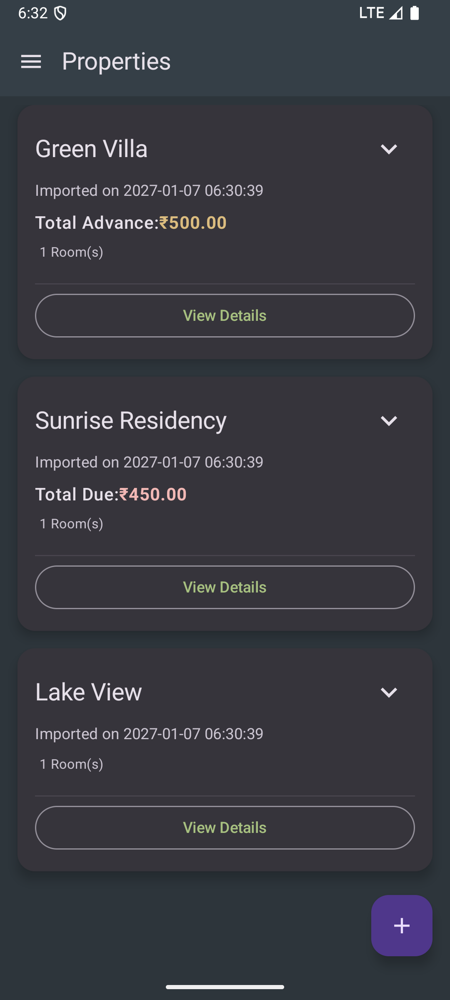
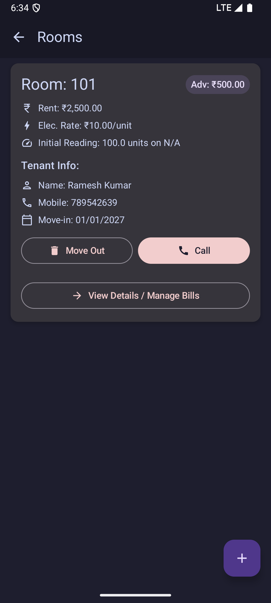
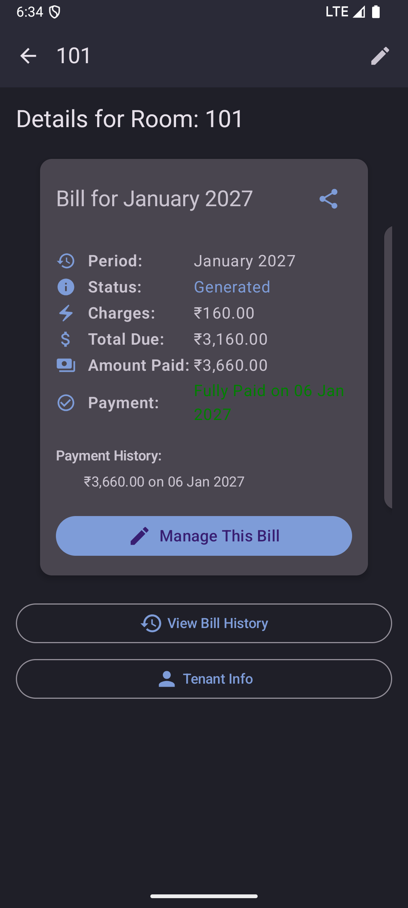
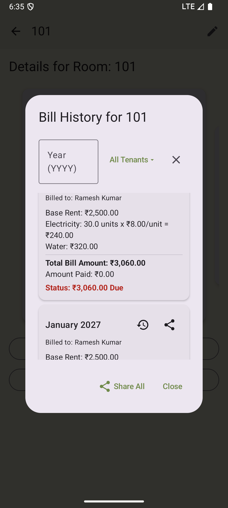
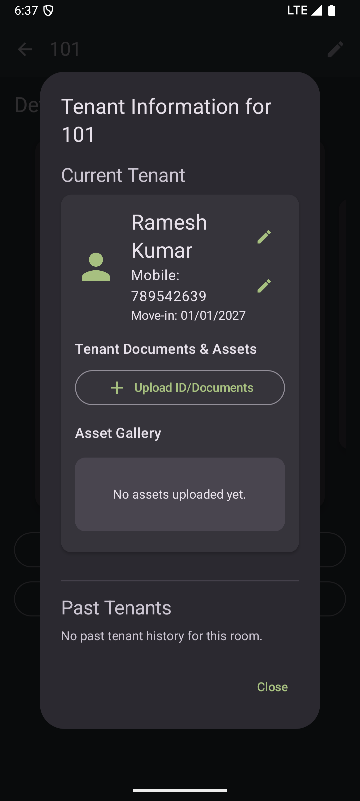
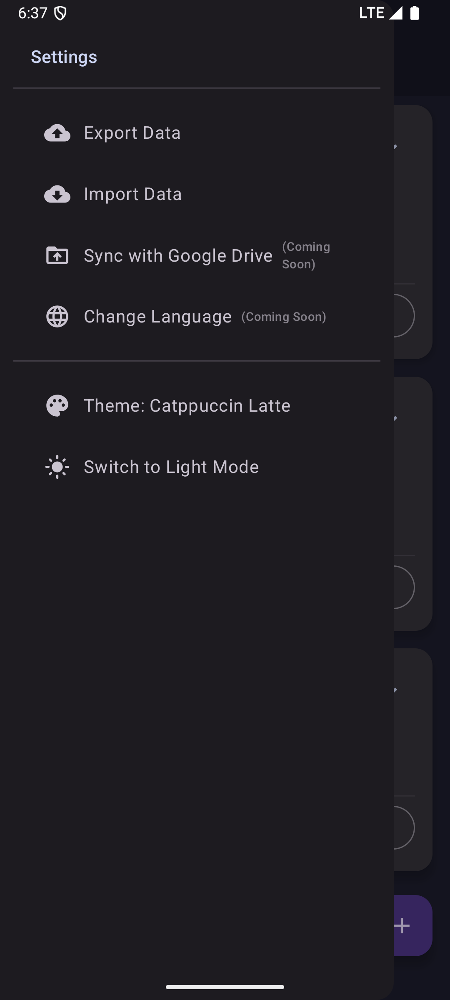

# Property Manager (India)

<p align="center">
  
  <br/>
  <strong>A comprehensive, modern, and easy-to-use Android application to help you manage your properties, rooms, tenants, and bills, with a focus on the Indian market.</strong>
</p>
<br/>

## Key Features

The app is packed with features to make property management seamless and efficient, all from your device.

| Dashboard | Room Details | Bill Management |
| :---: |:---:|:---:|
|  |  |  |

| Bill History | Tenant Info | Settings |
| :---: |:---:|:---:|
|  |  |  |


### 🏠 Effortless Property & Room Management
- **At-a-Glance Dashboard**: View all your properties on a clean, modern interface. See a summary of total dues and advances for each property.
- **Detailed Room Info**: Manage individual rooms, setting custom rent, electricity rates, and tracking initial meter readings.
- **Occupancy Tracking**: Quickly see which rooms are occupied and who the current tenant is.

### 👥 Comprehensive Tenant Management
- **Centralized Tenant Records**: Keep track of all tenant information, including name, contact details, and move-in/move-out dates.
- **Document & Asset Storage**: Upload and store important tenant documents (like ID proofs) and photos of room assets.
- **Past Tenant History**: Maintain a record of past tenants for each room for future reference.

### 🧾 Automated & Detailed Billing
- **Monthly Bill Generation**: Automatically generate monthly bills based on rent, electricity usage, and other charges.
- **Prorated Rent Calculation**: The app automatically handles prorated rent for tenants who move in mid-month.
- **Payment Tracking**: Record full or partial payments for each bill. The app clearly shows the remaining balance, if any.
- **Bill History**: Access a detailed, filterable history of all past bills for any room. Filter by year or tenant to find what you need quickly.

### 🌐 Advanced Data & Sharing
- **Data Import & Export**: Seamlessly import and export your property, room, tenant, and billing data using CSV or plain text formats. Perfect for backups or migrating to a new device.
- **Intelligent Import**: The app intelligently handles imported data, updating existing records and creating new ones while preserving data integrity.
- **Easy Sharing**: Share a neatly formatted summary of any bill with your tenants via WhatsApp, SMS, or any other app.

### 🎨 Personalization
- **Light & Dark Themes**: Switch between a beautiful light or dark theme for comfortable viewing in any lighting condition.
- **Multi-Language Support**: The application is fully localized for both English and Hindi, with the ability to switch languages on the fly.

---

## Technologies Used

*   **Kotlin**: Primary programming language.
*   **Jetpack Compose**: For building the modern, reactive user interface.
*   **Jetpack Room**: For local database storage.
*   **Jetpack ViewModel**: To manage UI-related data in a lifecycle-conscious way.
*   **Jetpack Navigation**: To handle in-app navigation.
*   **Hilt**: For dependency injection.
*   **Material Design 3**: For UI components and styling.

## Getting Started

1.  Clone the repository:
    ```bash
    git clone https://github.com/SunnyGitGud/Dorm-Hostel-Manager
    ```
2.  Open the project in Android Studio (latest stable version recommended).
3.  Let Android Studio download the necessary Gradle dependencies.
4.  Build and run the application on an Android emulator or a physical device.

## Contributing

Pull requests are welcome. For major changes, please open an issue first to discuss what you would like to change.

Please make sure to update tests as appropriate.

## License

[MIT]